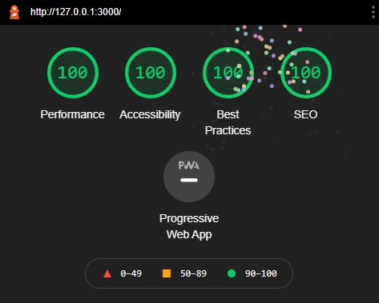
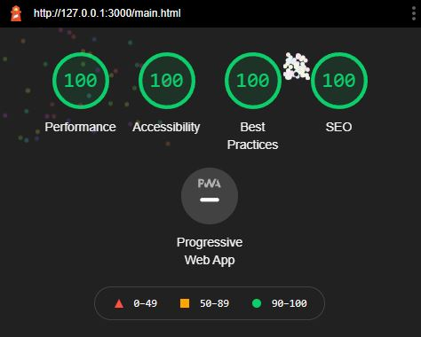

## Persistent Securities Portfolio

https://securities-portfolio-persistent.glitch.me

**Summary/Goal**: My application is a stock, ETF, or index fund financial portfolio creator and manager. The goal of this application is to allow users to create and
manage their own financial securities portfolio. The site gathers information from the user about a security to produce a portfolio listing and attaches that item to
the user's account. Information that the user must enter includes the name of the security, its ticker symbol, its price in dollars, and the amount of shares that the
user owns. The site produces a derived field that denotes the total dollar amount that the user has invested in the security. All of the information that the user enters
plus the derived field is used to append a portfolio listing to the page that the user can edit and remove.

**Challenges**: Challenges I faced in realize this application include being able to attach a portfolio listing to a particular user in the database. Also, planning the
organization and structure of my database was difficult conceptually, since I had never worked with services like MongoDB before. Learning my CSS framework, Bootstrap,
was not difficult but was time consuming, as there are many classes and options for each element that I used on my webpage.

**Authentication Strategy**: The application is authenticated with a simple login form, cookies, and a MongoDB collection. This involved storing the user's username as a
property of the client session using the cookie-session middleware package. This strategy was the easiest to implement because when a request is made, the client can check
whether or not the user can access a certain portfolio listing which is attached to a particular user. If the user enters a valid username and password, they will be sent
to their respective portfolio with listings only associated with their account. If the user enters an invalid username or password, they will be shown a message prompting
them to try again. Since this app does not include functionality for creating a new account if one with the given credentials does not exist, I have listed three valid
accounts that are stored in the database with two sample items each.

- **Test User 1**: Username: user1, Password: pass1
- **Test User 2**: Username: user2, Password: pass2
- **Test User 3**: Username: user3, Password: pass3

**CSS Framework**: The CSS framework that I used was Bootstrap because it is very flexible and easy to work with. Also, Bootstrap is one of the most popular front-end
frameworks and provides a solid foundation for my application through its convenient grid system. Additionally, Bootstrap includes extensive styling for almost every
HTML element including tables, forms, buttons, images, icons, code, and typography.

**Express Middleware Packages**: The express middleware packages that I used for this application were body-parser, timeout, errorhandler, compression, morgan, and
cookie-session which are described below.

- **body-parser**: Parses incoming request bodies to json in a middleware before handlers, available under the req.body property.
- **timeout**: Times out a request after five seconds in the Express application framework.
- **errorhandler**: Sends full error stack traces and internal details of any object passed to this module when an error occurs and configured a custom output as a system
  notification instead of STDERR.
- **compression**: Attempts to compress response bodies for all request that traverse through the middleware based on the default options.
- **morgan**: Logs HTTP requests in the console using a format string of predefined tokens.
- **cookie-session**: Stores session data on the client within a cookie to save and connect login information.

### Technical Achievements

**Tech Achievement 1**: I hosted my application on Heroku instead of Glitch and found that it required more of a learning curve to use than Glitch but was faster. Updates
that were required in order to deploy my application onto Heroku included listening on a PORT environment variable and adding the MongoDB environment variables to my Heroku
settings. Also, Heroku supports automatic deployments from GitHub which means that every push to the main branch of this application will deploy a new version. This is extremely
convenient compared to Glitch because it removes the need for re-deploying the app after developing locally.

**Tech Achievement 2**: As shown in the images below, I earned 100% in all four lighthouse tests required for this assignment including Performance, Best Practices, Accessibility,
and SEO for both the main and login pages.

### Design/Evaluation Achievements

**Design Achievement 1**: Below, I describe how my site uses the CRAP principles from the Non-Designer's Design Book readings.

- **Contrast**: The element which receives the most contrast is the "Short Stack Securities Portfolio" title on both the main and login page. This is primarily because
  the font and size are much different than the font and size of text on the rest of the page. Also, the background surrounding the title is dark while the text inside
  the header is light, a property only shared by the buttons on the main page. The elements that received the second most contrast on each page were the login button on
  the login page and the submit button on the main page. Both the login button and the submit button feature bootstrap's classic "success" color to distinguish from other
  elements. The submit button is larger than the other buttons, remove and edit, and both the login and submit buttons are the only colorful buttons on each page.

- **Proximity**: I used proximity to organize the visual information on your page by grouping related items together such as elements of the table, inputs, and directions.
  The table elements section occupied the leftmost section of the page with nothing below it, allowing the table to grow without influencing other element groups. Each item
  added to the table was appended in a top-down fashion so that items of the table are seen as one cohesive group rather than a bunch of unrelated bits. The inputs section
  occupies the upper right section of the page, with the directions group directly below it. This section lists the information the user must enter to complete a table entry
  and is also grouped in a top-down fashion as one cohesive group. The directions section lists information related to using the application, is located directly below the
  inputs section and is grouped similarly.

- **Repetition**: Elements that I used repeatedly throughout my site include dark and light colors, the Helvetica Neue font, and sub-headers. A dark, almost black, color is
  used to create remove and edit buttons for each new portfolio entry which never changes. The color black is also used for the majority of the text outside of buttons and the
  main header and is used for lines on the table. The majority of the page is light as a result of the background which covers all of the regular text and elements except the
  main header. Also, the same font size is used for all text that is not a header or inside a button, which makes it clear that certain text is copy-text and other text holds
  some other significance such as a button or header.

- **Alignment**: I used alignment to organize information and increase contrast for particular elements by placing elements to convey a visual connection to something else on
  the page. For example, the main header is centered to convey ownership over all elements on the page, as the title should encompass all element groups. The remove and edit
  entry buttons are placed close together in the table because they both represent functionality for changing the portfolio. The submit button is placed directly below the
  inputs because the first place a user will look after entering the last bit of input information is below the last input. The site directions are placed lowest on the page
  because they are the least important section on the site, so they call for the least emphasis.
